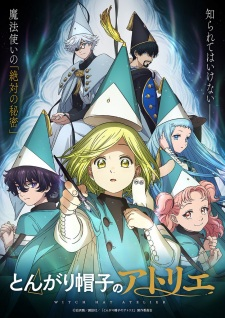
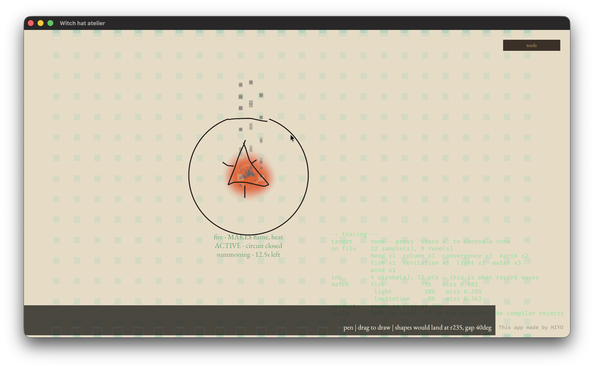
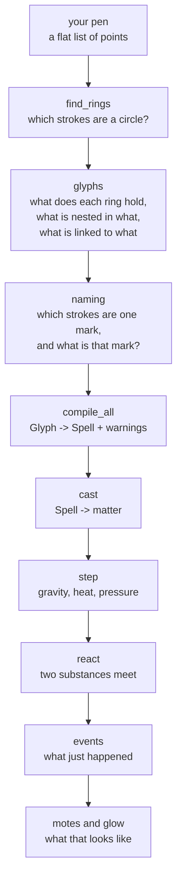
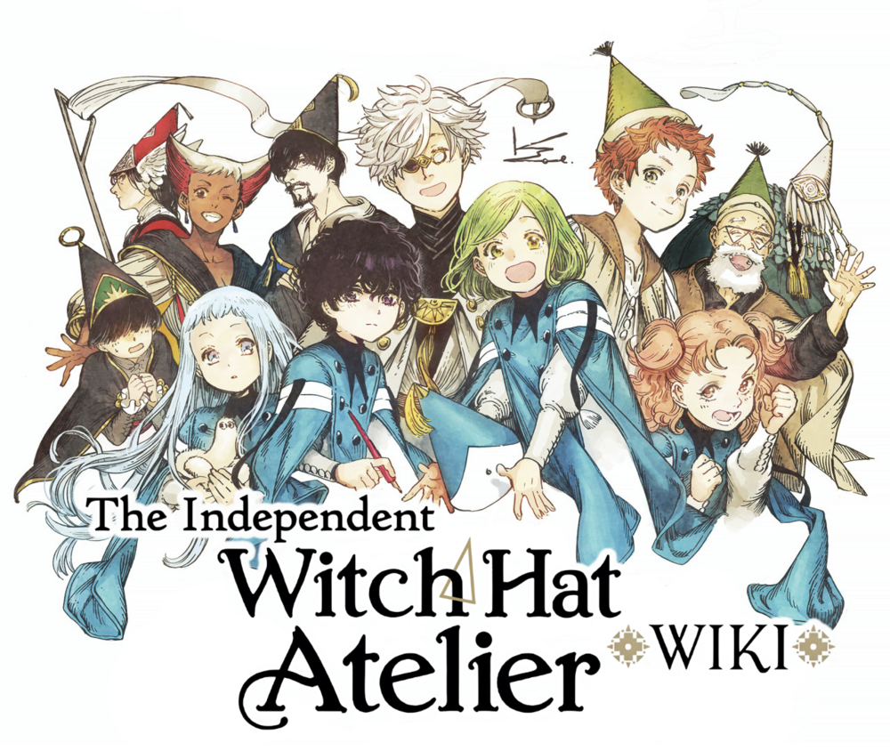

<p align="center">
  
</p>

# Witch Hat Atelier (とんがり帽子のアトリエ / Tongari Boushi no Atelier)

I made an simulations that simulate the magic that happen in the anime, First impression when i watched the anime is just the magic system in this anime similar like how programming work, we have a compiler, type kind of thing, configuration and so on yeah you know how programming work, in this anime it's really similar but it's more simplify but we can still simulate it, and with AI helped on particle effect and reaction in the magic i presenting to you, witch hat atelier that written in rust, thanks to CLAUDE that made this possible cause without it, i'll made something worse than this

## What's this anime?

<p align="center">
  
</p>

[Witch hat Atelier](https://myanimelist.net/anime/51553/Tongari_Boushi_no_Atelier) is an anime that talk about a girl called Coco, that really loves magic or in my scenario programming and code (yeah this anime literally me lmao), Okay maybe i can't really talked about this anime but here's the synopsis of the anime itself, you may read it or watch it, it's a good anime so far
`In a world where witches wield breathtaking magic, Coco, coming from a humble background, often wishes she were born one herself. After all, the secret behind casting magic is strictly guarded from non-witches. But when Coco manages to catch a glimpse of the witch Qifrey casting a spell, her revelation on the truth behind magic drastically alters the course of her life.
However, Coco's curiosity pays a steep price when a disastrous spell cast in ignorance brings a tragic fate upon her beloved mother. Qifrey takes the shaken girl in, recognizing both her resolve to save her mother and her link to a group of forbidden magic heretics. Secrets are a heavy burden, and between navigating a society that views her as an uninvited guest and mastering the art of magic, Coco must give her all to prove her worth as a witch.`
For further infomation about this anime you may checked it to [myanimelist](https://myanimelist.net/anime/51553/Tongari_Boushi_no_Atelier) & [atelier wiki](<https://witchhatatelier.telepedia.net/wiki/Witch_Hat_Atelier_(Manga)/List_of_Chapters>) it's explain it more good than mine

## How the magic works

Like programming itself we need the to declare what kind of language we want to write (js, py, rust) and write our code, and compiler this anime also have the same thing

<p align="center">
  
</p>
As you can see,
ring/circle = compiler
Signs/icon that arround it = code
Sigils/icon in the middle = programming language
similar right, and not just that, we can draw a circle inside of a circle, and so on, or connect another circle to another circle yeah, exactly how programming works, GOD I LOVE PROGRAMMING but sometimes they hate me.

### and here's the part where the analogy actually holds

The thing that made me want to build this is that the analogy doesn't fall apart
when you push on it. Three parts, and each one has exactly one job:

| the drawing                            | programming  | what it decides        |
| -------------------------------------- | ------------ | ---------------------- |
| **Sigil** — the mark in the middle     | the language | **what** kind of magic |
| **Signs** — the marks around it        | your code    | **how** it behaves     |
| **Ring** — the circle round everything | the compiler | **when** it runs       |

Change the sigil, you change the element. Change the signs, you change what that
element _does_. Close the ring and it runs. Leave a gap in the ring and it's a
prepared spell just sitting there waiting — which is a real thing in the manga,
and in the app it's a real thing too: draw the last stroke and it fires.

And the best part is that none of those three know about each other. The sigil
doesn't know what signs are around it. The signs don't know what element they're
shaping. The ring doesn't know either — it only knows whether it's closed. All
the interesting behaviour comes out of putting them together, which is exactly
what a systems-y magic system should feel like.

## So what does this thing actually do

<p align="center">
  
</p>

That's a fire sigil I drew by hand, inside a ring I also drew by hand. Nothing
there is a button — the app watched the ink, recognised the rune, worked out
that the circuit closed, compiled it, and set fire to the middle of it.

The green text on the right is the app telling you what it thinks: `fire 75%,
miss 0.081` means my drawing sits 75% of the way between _perfect_ and _the
point where the compiler stops believing me_. I like that it shows its working.
When a spell doesn't fire I want to know whether it's because I drew badly or
because the rules said no, and those are very different problems.

## The rules it follows

These aren't mine. They're from the manga, and they're all in the wiki. Every one
of them is a real branch in the code somewhere:

1. **Everything has to be inside the ring, or touching it.** Ink outside doesn't
   count. It's not an error though — it just does nothing.
2. **A spell only goes off when its ring is complete.** A gap = a loaded spell.
3. **You can split a seal across two objects.** Touch them together and it fires,
   pull them apart and it stops.
4. **Rings inside rings.** The outer one gates everything inside it, even if the
   inner one is perfectly closed.
5. **Linked seals amplify each other** — several small ones linked together beat
   one big one covering the same space.
6. **A reversed sign does the opposite**, and a spell plus its mirror image
   cancel out completely.
7. **Symmetry matters.** Asymmetric seals still work, they're just unstable.
8. **Bigger seal = stronger. Neater seal = lasts longer.**
9. **A ring on its own is a bomb.** Not a no-op — an explosion.

Rule 9 is switched off by default in the app, and that's a decision rather than a
bug. While the app only knows a handful of runes, _every_ seal it can't read
compiles to the same explosion — so "blast" would be what almost every misread
drawing does, and it'd bury the thing you were actually trying to look at. A seal
fires when it was **understood**. Turn `learned` off in the panel and rule 9
comes straight back.

## The physics is not faked

This is the part I'm most happy with. The elements don't have a "goes up" flag.

Fire rises because of **Archimedes and the ideal gas law**, and that's it:

```
a      = g × (1 − ρ_fluid / ρ_body)      buoyancy
ρ(T)   = ρ_ref × T_ref / T               gas gets thinner as it heats
```

In `materials.ron`, flame has `density: 1.2` — **exactly the same as air**.
Nothing anywhere says flame goes up. But flame is _hot_: at 800 °C it's about a
third the density of the room, so the bracket comes out around −2.6 and it climbs
at two and a half gravities. Let it cool and it stops climbing **on its own**,
because the reason went away. That's the whole point of modelling it instead of
scripting it.

Steam is the other half of the argument. It's `0.6`, because a water molecule is
lighter than the nitrogen it pushes out of the way — so **steam keeps rising even
after it's gone cold**, which no "hot things go up" rule could ever produce.

Most of the numbers are just real: air 1.2, water 1000, ice 917 (which is why ice
floats), stone 2600, sand 1600.

Water needed one more thing to feel like water: it's nearly **incompressible**.
Without a term for that it just collapses into whichever cell is lowest and sits
there as a dot — no surface, no level, no pool. And fire needed to flicker, but
`rand()` was off the table because the whole simulation has to be reproducible —
so the flicker is a _hash_ of position and tick. Same seal, same frame, same
flicker, every run, every machine.

## What a sigil is allowed to do

This is my favourite thing in the whole wiki and it's the reason the simulation
has any teeth:

| sigil         | can it make it? | can it move it? |
| ------------- | --------------- | --------------- |
| **wind**      | ✗ no            | ✓ yes           |
| **aeriforms** | ✓ yes           | ✗ no            |
| **earth**     | ✗ **never**     | ✓ yes           |
| **water**     | ✓ yes           | ✓ yes           |

Wind moves air but **cannot create it**. Aeriforms creates air but **cannot move
it**. Earth moves stone and wood and sand and can never make any of it.

So a wind spell in an empty room has to _find_ its air somewhere, and if there
isn't any, nothing happens and the app says so. An earth spell with no stone
nearby does nothing. That's not a limitation I added for flavour — it's in the
source, and encoding it is what turns the simulation from "spawn some particles"
into something with actual conservation rules.

## The runes are traced, not invented

The shapes belong to the manga. I'm not going to make them up and pretend, so the
app ships with its rune file **empty** and there's a `record` button: you draw a
rune, press record, and it's live and being matched a second later. No rebuild.

I traced **fire, water, earth, wind and light** myself. The keystones are still
placeholders — reconstructions, honestly labelled as such — and the moment
somebody traces a real one it wins automatically.

The recogniser is **$P** (Vatavu et al.), point-cloud matching at 32 points. It
divides out position and size, because the manga says a sigil's size and location
don't change what it does. It **keeps rotation** for sigils, because a reversed
mark means the opposite thing (rule 6) — but it has to _ignore_ rotation for
signs, because four arrows around a ring point four different ways and that's the
normal way to draw a seal. Getting that distinction wrong meant three out of
every four keystones were unreadable, which took me embarrassingly long to spot.

## How it's actually built

Two crates, and the split is strict.

**`magic-core`** knows what magic _means_. No Bevy, no graphics, no filesystem,
no threads, no clock, no random numbers. It compiles to `wasm32` untouched, and
that constraint isn't decoration — it's what kept every temptation out. Parsers
take strings instead of paths. Elapsed time comes from counting ticks. The fire
flicker is a hash instead of an RNG. I wrote my own `Vec2` rather than pull in a
dependency for sixty lines of arithmetic.

**`apps/canvas`** is the Bevy shell. Input and pixels. It never decides anything
about magic — it asks core and draws the answer. What colour water is on your
screen is not a fact about magic, so that lives in the shell; what a fire sigil
_looks like_ decides what a drawing means, so that lives in core.

Here's the whole pipeline, from your pen to a flame:



### Finding the ring

A ring is fitted with **Taubin's method**, not the usual Kåsa least-squares.
Kåsa is biased on arcs, and arcs are not an edge case here — rule 2 makes a
gapped ring a completely legal prepared spell, and rule 3 splits one ring across
two objects. The correction is literally one number subtracted from the diagonal
of the solve, so there was no reason to accept the bias.

**A ring is not a stroke**, which took me a while to accept. An arc plus the
short line that closes it is _one_ ring. So strokes that curve far enough to name
a circle become seeds, and then any stroke whose ink lies on that circle joins it.
Drawing order is never an input — you can draw the ring first or last or in six
pieces and get the same seal.

Three independent signals decide whether it's really a ring, and each one catches
something the others can't:

- **roundness** — is this a circle at all, or a chevron? (a bent line fits a
  circle beautifully if you don't ask this)
- **closure by endpoints** — every loose end has to have another end near it.
  _Not_ angular coverage: two arcs can cover every direction from the centre
  without ever touching, and the app called that closed for an embarrassing
  while. The manga is physical about it too — the split-seal halves complete a
  spell when they **touch**.
- **winding** — a figure-eight covers a full turn and nets zero; a double loop
  covers one turn and winds two. Comparing the two rejects both.

Plus a floor on how many points a stroke needs to seed a ring, which sounds
arbitrary and isn't: **three points fit a circle exactly**. A perfect fit through
three points is not evidence of anything, so roundness is structurally blind to a
three-point corner — and that's exactly what an arrowhead becomes after
resampling. Four keystones were each being found as their own tiny ring.

### Reading the marks (the algorithm I'm proudest of)

The recogniser is **$P**: resample the ink to 32 points, throw away position and
size, and greedily match point clouds. But before you can recognise anything you
have to answer a harder question — **which strokes are one mark?** Fire is four
strokes. A keystone is two. "One stroke, one mark" is wrong for basically
everything.

My first two attempts both tried to settle it with a distance: strokes closer
than _this_ are one mark. Both failed, and the runes I traced are what proved it.
Measured on my own recordings:

- the widest gap **inside** one mark: **35px** (water is three teardrops drawn
  well apart)
- the gap **between** a sigil and the keystone beside it: **32px**

There is no number between 35 and 32. Any threshold either shreds water into
three unreadable blobs or glues a keystone onto the sigil.

So segmentation stopped being geometry's problem. **Geometry proposes and the
recogniser disposes:**

1. Merge strokes together cheapest-gap-first. That builds a binary tree — leaves
   are strokes, the root is everything the ring holds. It contains every
   _spatially sensible_ grouping and no others, which is `2n−1` nodes instead of
   `2^n` subsets.
2. Score every node by asking $P what it is.
3. Take the best cut of the tree by dynamic programming — each node is either one
   mark, or the best its two halves can do separately.

A blob loses to its parts when the parts read as something, and wins when they
don't. Water's teardrops merge because separately they're nothing and together
they're water. The sigil and the keystone stay apart because together they're
nothing and separately they're two marks. **Same rule, opposite answers** — which
is the thing a threshold can never do.

Scoring took two goes to get right. A reading is worth **the share of ink it
explains**, times its quality **squared**. Share alone lets one big blob that
vaguely matches something beat five exact small marks; quality alone lets every
single stroke call itself a keystone (any straight line matches a column at
_some_ angle) and shred a sigil into six pieces. Squaring is the difference
stated numerically: a big wrong blob is always a _near_ miss, and a small right
mark is an exact hit, so a near miss is worth a quarter of a hit.

### Compiling

`compile(glyph, catalog) -> Spell`, and **there is no error type**. That's not
laziness, it's the manga: almost nothing is invalid. An unbalanced seal fires
sideways. An asymmetric one fires unstably. An open one is a _prepared_ spell,
not a broken one. So every glyph compiles, and everything wrong with it rides
along as a warning carrying the number behind it — the app can say "leans 0.4
toward 130°" and never has to say "invalid".

Sigils and signs aren't enums. They're names in `.ron` files, because adding a
spell shouldn't need a recompile. Code holds the closed vocabularies (families,
tiers, classes); data holds all 34 sigils, 44 signs and 46 spell fixtures.

### The simulation

A **parcel** is the smallest thing that can be conserved: a lump of some
substance with a position, a velocity, a mass, a temperature and a countdown.
They live in a flat list. Over them sits a grid of **cells**, and a cell is
always a _summary_ — density, temperature and mean flow are recomputed from the
parcels every tick and never written directly. Everything is mass-weighted, so a
speck can't outvote a boulder.

Four forces, and each exists because something looked wrong without it:

- **buoyancy** — the Archimedes/gas-law pair from earlier. This is what makes
  fire fire.
- **cohesion** — how hard a parcel pulls toward its cell's mean flow. Water at
  7.0 moves as a body; flame at 0.25 disperses. Same loop, opposite feel.
- **stiffness** — liquids are nearly incompressible. Getting this working needed
  a real fix rather than a tuning pass: a pressure gradient sampled at cell
  _centres_ cancels exactly for any symmetric blob, so a lone dense cell pushes
  equally in all four directions and therefore not at all. Cells carry a
  **centroid** — where the mass actually is, which isn't the cell's middle — and
  pressure pushes away from that. The term vanishes in an even pool and bites
  hardest in a heap, which is precisely what you want.
- **turbulence** — the deterministic flicker, scaled by heat, so a cooling flame
  stops flickering for the same reason it stops rising.

**Reactions** happen to a _place_. Parcels are bucketed by cell and a rule is
tested against the cell's temperature, not any one parcel's. The scarcer input
sets the pace, so one drop of water can't consume a bonfire. Output shares must
total exactly `1.0` and the file is **refused at load** otherwise — a rule that
quietly minted matter would make every conservation guarantee a lie.

Two housekeeping passes earn their place: `coalesce` merges same-substance
parcels sharing a cell (exactly — mass, momentum and heat all conserved), because
reactions emit new parcels and merge none, and I once ended up with 36,756
parcels holding 400 units of mass. And `scrub` catches a ruined parcel and counts
it on screen, because a `NaN` is the silent version of a crash and it spreads
through every sum it touches.

### The particle system

The thing that took me longest to see: **drawing _state_ can never show what
happened.** A blast is over in one tick. By the next frame the only trace is some
parcels moving outward, which nobody can read as an explosion.

So the simulation says _what occurred_ and the shell decides what that looks
like:

```
Blast · Summon · Refused · Ignite · Douse · Spent · Flash · Reacted
```

Each one carries a place and enough detail to draw it. The shell has a look table
with an entry for **every** variant and **every** substance in the materials
file, including ones nothing emits yet — because a hole in a look table fails
_silently_, and you can never tell a missing rule from a missing colour.

The nicest bit is that motion carries meaning. **Creating blooms outward.
Gathering falls inward.** That's the capability model made visible — you can see
whether a spell _made_ its substance or _took_ it from the room without reading a
number. A refusal is grey and falls, because a spell being denied should look
like a failure rather than like nothing.

Light needed two halves. Dimming the room alone is just a room going dark for no
reason, so there's a glow pass too: a radial falloff texture generated at startup
(six lines of arithmetic — I didn't want another binary in the repo), drawn under
the ink for anything that glows and for every burning prop. Capped at 40 lamps,
because a big fire is hundreds of parcels and a halo is a large transparent
sprite.

And one rule holds the whole thing together: **no particle is ever read back.**
No mote touches a parcel, a prop, a field or a spell. Delete the entire module and
every number the simulation reports is identical. That's the test for anything
that gets added to it.

### Everything is reproducible

Same inputs, same outputs, every run, every machine. No wall clock, no RNG, no
hash-map iteration order in any simulation path, fixed timestep.

That sounds like a small promise and it cost real work. Float addition isn't
associative, so the same seal with its signs listed in two different orders gave
`0.051757645` and `0.051757623` — a genuine bug, found by a property test, fixed
by sorting the contributions before summing. Drawing order is never an input
either, which is why glyph assembly is a _query over the finished page_ rather
than anything that watches you draw.

573 tests, about a second to run. Every bug in here got a failing test before it
got a fix, and a few of them are written as _pairs_ on purpose — because a rule
that's backwards passes half of any test you write for it.

## Two elements in one working

Rule 4 again: two complete seals inside one big ring. There's a preset called
**kettle** — fire below with its arrows pointing up, a water orb held above it.

And here's the thing I want to point at: **nothing in the compiler knows what
fire plus water means.** There's no "boiling" spell. The flame rises because it's
hot and thin, the water boils because the reaction rules say water above 100 °C
becomes steam, and the steam climbs because it's lighter than air. Every step is
a rule that was already there for its own reasons, and boiling just… happens.
That's the difference between a system and a list of special cases, and it's the
reason I wanted a simulation instead of animations.

## Try it

```sh
./run.sh                      # builds a real .app and launches it
cargo test --workspace        # 573 tests, about a second
```

Rough tour once it's open:

- **pen** and just draw. A circle with something in the middle is a spell.
- **seal >** picks a ready-made one, **seal** puts it on the page.
- **guide** teaches you the same seal one stroke at a time.
- **kindle** scatters wood and cloth around so your fire has something to burn.
- **spell** and **world** show you what the app is thinking.
- Move the mouse through a running spell — you can push it around a bit.

## What's from the manga and what's mine

I tried to be strict about this because it matters:

**From the source:** all nine rules above, the three-part grammar, the sigil
capabilities, "size is power", the tilt-versus-spin tradeoff, the four ways signs
can be arranged, the names of everything.

**Mine:** every actual _number_. The manga says a badly drawn seal is unstable
and never says how unstable, so every threshold in here is a choice I made and
marked as one. The whole reaction layer is mine too — there's no "wind plus water
equals vortex" in the source, so those rules live in a data file you can argue
with instead of a match statement you'd have to recompile.

**Deliberately left empty:** where the wiki says an effect is unknown, the data
says unknown. Two spells are in the catalogue with nothing but a name, because
that's genuinely all anyone knows about them. An honest hole beats a plausible
guess.

## Thanks

<p align="center">
  
</p>

Basically all of the magic research came from the
**[Independent Witch Hat Atelier Wiki](https://witchhatatelier.telepedia.net/)** —
the _Magic_, _Sigils Explained_ and _Signs Explained_ pages especially. Whoever
wrote those did an unreasonable amount of work and this project wouldn't exist
without them.

_Witch Hat Atelier_ is Kamome Shirahama's. I don't own any of it, I make no money
from this, and the artwork above belongs to its publishers — it's here to point
at the thing I'm talking about. This is a hobby project by someone who watched an
anime and thought "hang on, that's a compiler".

Thanks to the anime, and my toilet that gave me this idea, anyway this project build with ❤️from anime fan
